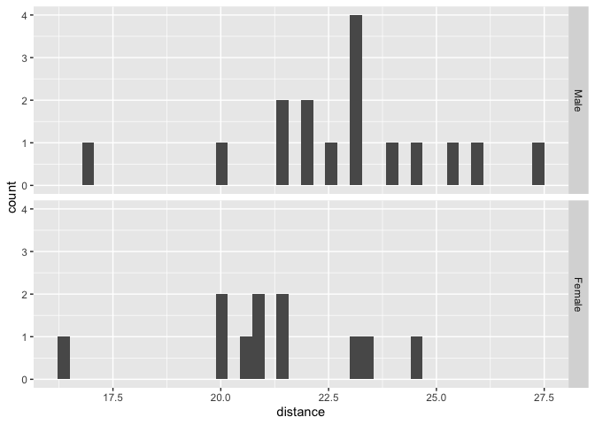
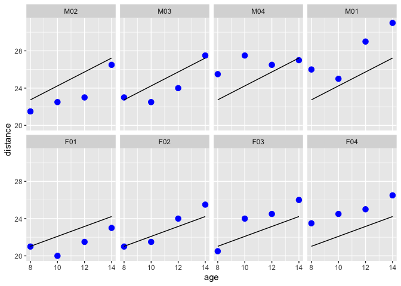
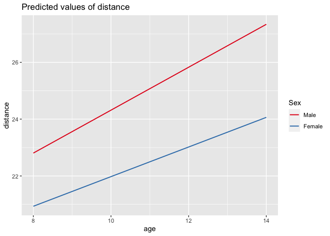

Linear Mixed Effect Models with the Orthodont Dataset
================
Lucas Mendicino
10/30/2021

# Setup

``` r
library(dplyr)
library(ggplot2)
library(lme4)
library(nlme)
library(sjPlot)
```

# Exploration

The Orthodont dataset has 108 rows and 4 columns of the change in an
orthodontic measurement over time for several young subjects.

Investigators at the University of North Carolina Dental School followed
the growth of 27 children (16 males, 11 females) from age 8 until age
14. Every two years they measured the distance between the pituitary and
the pterygomaxillary fissure, two points that are easily identified on
x-ray exposures of the side of the head.

Let’s explore the dataset:

``` r
summary(Orthodont)
```

    ##     distance          age          Subject       Sex    
    ##  Min.   :16.50   Min.   : 8.0   M16    : 4   Male  :64  
    ##  1st Qu.:22.00   1st Qu.: 9.5   M05    : 4   Female:44  
    ##  Median :23.75   Median :11.0   M02    : 4              
    ##  Mean   :24.02   Mean   :11.0   M11    : 4              
    ##  3rd Qu.:26.00   3rd Qu.:12.5   M07    : 4              
    ##  Max.   :31.50   Max.   :14.0   M08    : 4              
    ##                                 (Other):84

``` r
str(Orthodont)
```

    ## Classes 'nfnGroupedData', 'nfGroupedData', 'groupedData' and 'data.frame':   108 obs. of  4 variables:
    ##  $ distance: num  26 25 29 31 21.5 22.5 23 26.5 23 22.5 ...
    ##  $ age     : num  8 10 12 14 8 10 12 14 8 10 ...
    ##  $ Subject : Ord.factor w/ 27 levels "M16"<"M05"<"M02"<..: 15 15 15 15 3 3 3 3 7 7 ...
    ##  $ Sex     : Factor w/ 2 levels "Male","Female": 1 1 1 1 1 1 1 1 1 1 ...
    ##  - attr(*, "outer")=Class 'formula'  language ~Sex
    ##   .. ..- attr(*, ".Environment")=<environment: R_GlobalEnv> 
    ##  - attr(*, "formula")=Class 'formula'  language distance ~ age | Subject
    ##   .. ..- attr(*, ".Environment")=<environment: R_GlobalEnv> 
    ##  - attr(*, "labels")=List of 2
    ##   ..$ x: chr "Age"
    ##   ..$ y: chr "Distance from pituitary to pterygomaxillary fissure"
    ##  - attr(*, "units")=List of 2
    ##   ..$ x: chr "(yr)"
    ##   ..$ y: chr "(mm)"
    ##  - attr(*, "FUN")=function (x)  
    ##   ..- attr(*, "source")= chr "function (x) max(x, na.rm = TRUE)"
    ##  - attr(*, "order.groups")= logi TRUE

``` r
plot(Orthodont)
```

<!-- -->

``` r
Orthodont %>% group_by(age) %>% summarise(mean_distance = mean(distance), sd_distance = sd(distance))
```

    ## # A tibble: 4 × 3
    ##     age mean_distance sd_distance
    ##   <dbl>         <dbl>       <dbl>
    ## 1     8          22.2        2.43
    ## 2    10          23.2        2.16
    ## 3    12          24.6        2.82
    ## 4    14          26.1        2.77

``` r
Orthodont %>% group_by(Sex) %>% summarise(mean_distance = mean(distance), sd_distance = sd(distance))
```

    ## # A tibble: 2 × 3
    ##   Sex    mean_distance sd_distance
    ##   <fct>          <dbl>       <dbl>
    ## 1 Male            25.0        2.90
    ## 2 Female          22.6        2.40

Let’s look at the baseline measurements:

``` r
baseline <- Orthodont %>% filter(age == "8")
ggplot(baseline, aes(x=distance)) + geom_histogram(bins = 40) + facet_grid(vars(Sex))
```

<!-- -->

It looks like females had smaller distances at baseline compared to
males. Let’s compare the distributions with a Mann-Whitney Test:

``` r
baseline_male <- Orthodont %>% filter(age == "8", Sex == "Male")
baseline_female <- Orthodont %>% filter(age == "8", Sex == "Female")

wilcox.test(baseline_male$distance, baseline_female$distance, alternative = "two.sided", confint = TRUE)
```

    ## Warning in wilcox.test.default(baseline_male$distance,
    ## baseline_female$distance, : cannot compute exact p-value with ties

    ## 
    ##  Wilcoxon rank sum test with continuity correction
    ## 
    ## data:  baseline_male$distance and baseline_female$distance
    ## W = 128.5, p-value = 0.04713
    ## alternative hypothesis: true location shift is not equal to 0

Let’s visualize the distances at each age:

``` r
plot <- ggplot(Orthodont, aes(x = age, y = distance)) + geom_point(color = "blue") 
plot
```

<!-- -->

# Linear Models using lm()

Let’s run a simple linear model to measure the relationship between
distance and age:

``` r
lm1 <- lm(distance ~ (age), data = Orthodont)
summary(lm1)
```

    ## 
    ## Call:
    ## lm(formula = distance ~ (age), data = Orthodont)
    ## 
    ## Residuals:
    ##     Min      1Q  Median      3Q     Max 
    ## -6.5037 -1.5778 -0.1833  1.3519  6.3167 
    ## 
    ## Coefficients:
    ##             Estimate Std. Error t value Pr(>|t|)    
    ## (Intercept)  16.7611     1.2256  13.676  < 2e-16 ***
    ## age           0.6602     0.1092   6.047 2.25e-08 ***
    ## ---
    ## Signif. codes:  0 '***' 0.001 '**' 0.01 '*' 0.05 '.' 0.1 ' ' 1
    ## 
    ## Residual standard error: 2.537 on 106 degrees of freedom
    ## Multiple R-squared:  0.2565, Adjusted R-squared:  0.2495 
    ## F-statistic: 36.56 on 1 and 106 DF,  p-value: 2.248e-08

``` r
plot + geom_line(aes(x=age,y=predict(lm1)))
```

<!-- -->

``` r
plot + geom_line(aes(x=age,y=predict(lm1))) + facet_grid(.~Sex)
```

<!-- -->

We can see that age is a significant predictor of distance. Yet, when we
plot our fitted line separately for males and females, we see that we
overestimate for females and underestimate for males.

Let’s run another regression model with Sex as a predictor; males and
females will have the same slope, but different intercepts:

``` r
lm2 <- lm(distance ~ age + Sex, data = Orthodont)
summary(lm2)
```

    ## 
    ## Call:
    ## lm(formula = distance ~ age + Sex, data = Orthodont)
    ## 
    ## Residuals:
    ##     Min      1Q  Median      3Q     Max 
    ## -5.9882 -1.4882 -0.0586  1.1916  5.3711 
    ## 
    ## Coefficients:
    ##             Estimate Std. Error t value Pr(>|t|)    
    ## (Intercept) 17.70671    1.11221  15.920  < 2e-16 ***
    ## age          0.66019    0.09776   6.753 8.25e-10 ***
    ## SexFemale   -2.32102    0.44489  -5.217 9.20e-07 ***
    ## ---
    ## Signif. codes:  0 '***' 0.001 '**' 0.01 '*' 0.05 '.' 0.1 ' ' 1
    ## 
    ## Residual standard error: 2.272 on 105 degrees of freedom
    ## Multiple R-squared:  0.4095, Adjusted R-squared:  0.3983 
    ## F-statistic: 36.41 on 2 and 105 DF,  p-value: 9.726e-13

``` r
plot + geom_line(aes(x=age,y=predict(lm2))) + facet_grid(.~Sex)
```

<!-- -->

Let’s run another model considering the same intercept for males and
females, but different slopes

``` r
lm3 <- lm(distance ~ age:Sex, data = Orthodont)
summary(lm3)
```

    ## 
    ## Call:
    ## lm(formula = distance ~ age:Sex, data = Orthodont)
    ## 
    ## Residuals:
    ##     Min      1Q  Median      3Q     Max 
    ## -5.7424 -1.2424 -0.1893  1.2681  5.2669 
    ## 
    ## Coefficients:
    ##               Estimate Std. Error t value Pr(>|t|)    
    ## (Intercept)   16.76111    1.08613  15.432  < 2e-16 ***
    ## age:SexMale    0.74767    0.09807   7.624 1.16e-11 ***
    ## age:SexFemale  0.53294    0.09951   5.355 5.07e-07 ***
    ## ---
    ## Signif. codes:  0 '***' 0.001 '**' 0.01 '*' 0.05 '.' 0.1 ' ' 1
    ## 
    ## Residual standard error: 2.249 on 105 degrees of freedom
    ## Multiple R-squared:  0.4215, Adjusted R-squared:  0.4105 
    ## F-statistic: 38.26 on 2 and 105 DF,  p-value: 3.31e-13

``` r
plot + geom_line(aes(x=age,y=predict(lm3))) + facet_grid(.~Sex)
```

<!-- -->

Let’s combine the previous two models, now having different intercepts
and slopes for males and females

``` r
lm4 <- lm(distance ~ age:Sex + Sex, data = Orthodont)
summary(lm4)
```

    ## 
    ## Call:
    ## lm(formula = distance ~ age:Sex + Sex, data = Orthodont)
    ## 
    ## Residuals:
    ##     Min      1Q  Median      3Q     Max 
    ## -5.6156 -1.3219 -0.1682  1.3299  5.2469 
    ## 
    ## Coefficients:
    ##               Estimate Std. Error t value Pr(>|t|)    
    ## (Intercept)    16.3406     1.4162  11.538  < 2e-16 ***
    ## SexFemale       1.0321     2.2188   0.465  0.64279    
    ## age:SexMale     0.7844     0.1262   6.217 1.07e-08 ***
    ## age:SexFemale   0.4795     0.1522   3.152  0.00212 ** 
    ## ---
    ## Signif. codes:  0 '***' 0.001 '**' 0.01 '*' 0.05 '.' 0.1 ' ' 1
    ## 
    ## Residual standard error: 2.257 on 104 degrees of freedom
    ## Multiple R-squared:  0.4227, Adjusted R-squared:  0.4061 
    ## F-statistic: 25.39 on 3 and 104 DF,  p-value: 2.108e-12

``` r
plot + geom_line(aes(x=age,y=predict(lm4))) + facet_grid(.~Sex)
```

<!-- -->

Let’s compare information criterion for our 4 linear models to see which
best fits the data.

``` r
BIC(lm1,lm2,lm3, lm4)
```

    ##     df      BIC
    ## lm1  3 519.6234
    ## lm2  4 499.4121
    ## lm3  4 497.1948
    ## lm4  5 501.6524

``` r
AIC(lm1,lm2,lm3, lm4)
```

    ##     df      AIC
    ## lm1  3 511.5770
    ## lm2  4 488.6836
    ## lm3  4 486.4662
    ## lm4  5 488.2418

The third linear model, with same intercept for males and females but
different slopes, had the lowest BIC and AIC.

Let’s see how our model fits our data for a few participants

``` r
subjects <- c(paste0("M0",1:4),paste0("F0",1:4))
Orthodont.subset<- subset(Orthodont,Subject %in% subjects)
ggplot(data = Orthodont.subset) + geom_point(aes(x = age, y = distance), color = "blue", size = 3) + 
  geom_line(aes(x = age, y = predict(lm3, newdata = Orthodont.subset))) + facet_wrap(~Subject, nrow = 2)
```

<!-- --> The best
model does not fit the data that well. Some participants are
overestimated or underestimated.

Let’s view a spagehtti plot to see how distances change over time.

``` r
ggplot(data = Orthodont) + geom_point(aes(x = age, y = distance), color = "blue", size = 3)  + 
  geom_line(aes(x = age, y = distance, group = Subject))
```

<!-- -->

``` r
ggplot(data = Orthodont) + geom_point(aes(x = age, y = distance), color = "blue", size = 3)  + 
  geom_line(aes(x = age, y = distance, group = Subject)) + facet_grid(~Sex)
```

<!-- -->

It can be seen that many participants have a nonlinear change in
distance as they got older. They seem to grow at different rates and
start at different distances too. The linear model is not complex enough
to pickup on these effects. Even when we look within the same sex group,
we see participant’s slopes and intercepts changing even though the
distance seems to increase linearly.

We need to extend our model to take into account variability seen in
individuals.

# Linear Mixed Effect Model

Expanding our linear model to include mixed effects will allow us to
consider inter-individual variability in the outcome variable distance.

Let’s first run a linear mixed effect model expanding our first linear
model to allow for random variability in the intercept for each subject.

``` r
lmm1 <- lmer(distance ~ age + (1|Subject), data = Orthodont)
summary(lmm1)
```

    ## Linear mixed model fit by REML ['lmerMod']
    ## Formula: distance ~ age + (1 | Subject)
    ##    Data: Orthodont
    ## 
    ## REML criterion at convergence: 447
    ## 
    ## Scaled residuals: 
    ##     Min      1Q  Median      3Q     Max 
    ## -3.6645 -0.5351 -0.0129  0.4874  3.7218 
    ## 
    ## Random effects:
    ##  Groups   Name        Variance Std.Dev.
    ##  Subject  (Intercept) 4.472    2.115   
    ##  Residual             2.049    1.432   
    ## Number of obs: 108, groups:  Subject, 27
    ## 
    ## Fixed effects:
    ##             Estimate Std. Error t value
    ## (Intercept) 16.76111    0.80240   20.89
    ## age          0.66019    0.06161   10.72
    ## 
    ## Correlation of Fixed Effects:
    ##     (Intr)
    ## age -0.845

``` r
Orthodont$pred.lmm1 <- fitted(lmm1)
ggplot(data = subset(Orthodont, Subject %in% subjects)) + geom_point(aes(x = age, y = distance), color = "blue", size = 3) + 
  geom_line(aes(x = age, y = pred.lmm1)) + facet_wrap(~ Subject, ncol = 4) 
```

<!-- -->

Let’s add the interaction between age and sex as a fixed effect and
allow the random effects for the intercepts (fixed slopes for male and
females, random intercepts).

``` r
lmm2 <- lmer(distance ~ age:Sex + (1|Subject), data = Orthodont)
summary(lmm2)
```

    ## Linear mixed model fit by REML ['lmerMod']
    ## Formula: distance ~ age:Sex + (1 | Subject)
    ##    Data: Orthodont
    ## 
    ## REML criterion at convergence: 436.9
    ## 
    ## Scaled residuals: 
    ##     Min      1Q  Median      3Q     Max 
    ## -3.6795 -0.4887  0.0294  0.4986  3.7072 
    ## 
    ## Random effects:
    ##  Groups   Name        Variance Std.Dev.
    ##  Subject  (Intercept) 3.281    1.811   
    ##  Residual             1.912    1.383   
    ## Number of obs: 108, groups:  Subject, 27
    ## 
    ## Fixed effects:
    ##               Estimate Std. Error t value
    ## (Intercept)   16.76111    0.75344  22.246
    ## age:SexMale    0.75552    0.06433  11.745
    ## age:SexFemale  0.52151    0.06931   7.524
    ## 
    ## Correlation of Fixed Effects:
    ##             (Intr) ag:SxM
    ## age:SexMale -0.804       
    ## age:SexFeml -0.746  0.599

``` r
Orthodont$pred.lmm2 <- fitted(lmm2)
ggplot(data = subset(Orthodont, Subject %in% subjects)) + geom_point(aes(x = age, y = distance), color = "blue", size = 3) + 
  geom_line(aes(x = age, y = pred.lmm2)) + facet_wrap(~ Subject, ncol = 4) 
```

<!-- -->

Now, let’s expand the last model. We keep the age, Sex interaction as a
fixed effect and introduce a random effect such that intercepts (birth
distance) and slopes (growth rate) depend on the subject.

``` r
lmm3 <- lmer(distance ~ age:Sex + (age|Subject), data = Orthodont)
summary(lmm3)
```

    ## Linear mixed model fit by REML ['lmerMod']
    ## Formula: distance ~ age:Sex + (age | Subject)
    ##    Data: Orthodont
    ## 
    ## REML criterion at convergence: 435.8
    ## 
    ## Scaled residuals: 
    ##     Min      1Q  Median      3Q     Max 
    ## -3.2790 -0.4106  0.0347  0.4110  3.8607 
    ## 
    ## Random effects:
    ##  Groups   Name        Variance Std.Dev. Corr 
    ##  Subject  (Intercept) 5.41536  2.3271        
    ##           age         0.03048  0.1746   -0.65
    ##  Residual             1.71617  1.3100        
    ## Number of obs: 108, groups:  Subject, 27
    ## 
    ## Fixed effects:
    ##               Estimate Std. Error t value
    ## (Intercept)   16.76111    0.77525  21.620
    ## age:SexMale    0.75313    0.07061  10.666
    ## age:SexFemale  0.52500    0.07578   6.927
    ## 
    ## Correlation of Fixed Effects:
    ##             (Intr) ag:SxM
    ## age:SexMale -0.816       
    ## age:SexFeml -0.760  0.620

``` r
Orthodont$pred.lmm3 <- fitted(lmm3)
ggplot(data = subset(Orthodont, Subject %in% subjects)) + geom_point(aes(x = age, y = distance), color = "blue", size = 3) + 
  geom_line(aes(x = age, y = pred.lmm3)) + facet_wrap(~ Subject, ncol = 4) 
```

<!-- -->

Let’s now assume same birth distances for all individuals, but different
growth rates for individuals of the same Sex.

``` r
lmm4 <- lmer(distance ~ age:Sex + (-1 + age|Subject), data = Orthodont)
summary(lmm4)
```

    ## Linear mixed model fit by REML ['lmerMod']
    ## Formula: distance ~ age:Sex + (-1 + age | Subject)
    ##    Data: Orthodont
    ## 
    ## REML criterion at convergence: 439.8
    ## 
    ## Scaled residuals: 
    ##     Min      1Q  Median      3Q     Max 
    ## -3.9842 -0.3965 -0.0315  0.5012  3.5725 
    ## 
    ## Random effects:
    ##  Groups   Name Variance Std.Dev.
    ##  Subject  age  0.0255   0.1597  
    ##  Residual      1.9956   1.4126  
    ## Number of obs: 108, groups:  Subject, 27
    ## 
    ## Fixed effects:
    ##               Estimate Std. Error t value
    ## (Intercept)   16.76111    0.68237  24.563
    ## age:SexMale    0.74767    0.07342  10.184
    ## age:SexFemale  0.53294    0.07891   6.754
    ## 
    ## Correlation of Fixed Effects:
    ##             (Intr) ag:SxM
    ## age:SexMale -0.811       
    ## age:SexFeml -0.755  0.613

``` r
Orthodont$pred.lmm4 <- fitted(lmm4)
ggplot(data = subset(Orthodont, Subject %in% subjects)) + geom_point(aes(x = age, y = distance), color = "blue", size = 3) + 
  geom_line(aes(x = age, y = pred.lmm4)) + facet_wrap(~ Subject, ncol = 4) 
```

<!-- -->

Let’s compare information criterion for our linear models and linear
mixed effects models:

``` r
BIC(lm1, lm2, lm3, lm4, lmm1, lmm2, lmm3, lmm4)
```

    ##      df      BIC
    ## lm1   3 519.6234
    ## lm2   4 499.4121
    ## lm3   4 497.1948
    ## lm4   5 501.6524
    ## lmm1  4 465.7310
    ## lmm2  5 460.3152
    ## lmm3  7 468.5409
    ## lmm4  5 463.1800

``` r
AIC(lm1, lm2, lm3, lm4, lmm1, lmm2, lmm3, lmm4)
```

    ##      df      AIC
    ## lm1   3 511.5770
    ## lm2   4 488.6836
    ## lm3   4 486.4662
    ## lm4   5 488.2418
    ## lmm1  4 455.0025
    ## lmm2  5 446.9046
    ## lmm3  7 449.7659
    ## lmm4  5 449.7694

We see the second linear mixed effect model, assuming different fixed
effects for males and females and a random intercept, best predicts
distance.

``` r
Orthodont$pred.final <- fitted(lmm2)
ggplot(data = Orthodont) + geom_point(aes(x = age, y = distance), color = "blue", size = 3) + 
  geom_line(aes(x = age, y = pred.final)) + facet_wrap(~ Subject, ncol = 5) 
```

<!-- -->

``` r
plot_model(lmm2, type = c("pred"), terms = c("age", "Sex")) 
```

<!-- -->

Let

``` r
plot(ranef(lmm3))
```

    ## $Subject

<!-- -->

``` r
res <- residuals(lmm3)
plot(res)
```

<!-- -->

``` r
qqnorm(res)
qqline(res)
```

<!-- -->

# Use in nlme

The same models can be constructed using the nlme package as well:

``` r
lme1 <- lme(fixed = distance ~ age, random = ~ 1 | Subject, data = Orthodont)
lme2 <- lme(fixed = distance ~ age:Sex, random = ~ 1 | Subject, data = Orthodont)
lme3 <- lme(fixed = distance ~ age:Sex, random = ~ age | Subject, data = Orthodont)
lme4 <- lme(fixed = distance ~ age:Sex, random = ~ -1 + age | Subject, data = Orthodont)
```
